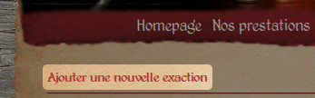

Gestion des fêtes passées et à venir
====================================

Ajouter/supprimer une fête
--------------------------

Deux entrées sont disponibles dans le menu du site : « Exactions passées » et
« Exactions à venir ». De plus, la première entrée présente un sous-menu,
présentant une liste des années actives de la compagnie, et renvoyant à la liste
des fêtes correspondantes à ces années. Chacune de ces 3 entrées propose un lien
pour créer une nouvelle fête (capture d'écran :ref:`ci-dessous <exaction-create>`).

.. _exaction-create:

   *Le lien permettant d'ajouter une nouvelle fête.*

Le placement de la fête dans le menu (« à venir » ou « passée ») se fait
automatiquement à partir de la date à laquelle a lieu la fête. Vous n'avez donc
pas à vous en préoccuper.

.. note::

    Le formulaire permettant de créer la nouvelle fête est le même que celui
    permettant de les éditer, mais ne présente pas tous les éléments. L'ensemble
    du formulaire est présenté dans la section suivante, en précisant quelles
    parties sont et ne sont pas disponibles lors de la création.

Éditer une fête
---------------

Au-dessus de chaque fête, à venir ou passée, vous trouverez
:ref:`un lien <exaction-form>` permettant d'accéder au formulaire d'édition des
fêtes.

.. _exaction-edit:

   *Le lien permettant d'éditer une fête.*

Vous pouvez voir :ref:`ci-dessous <exaction-form>` le formulaire permettant
d'éditer une fête. Seuls les éléments 1 à 7 sont disponibles lors de la création
de la fête, et seuls les champs 1 à 5 sont obligatoires.

.. _exaction-form:

   *Le formulaire d'édition d'une fête.*

1. le nom de la fête ;
2. le lieu de la fête (idéalement sous la forme « Ville (département) » ;
3. la date de début de la fête ;
4. la date de fin (s’il s'agit de la même que la date de début, alors
   l'application considère que la fête ne dure qu'une journée et n'affiche que
   cette date, dans le cas contraire les dates de début et de fin seront affichées
   sous la forme « jj au jj mois » ou « jj mois au jj autre-mois ») ;
5. l'emplacement de la fête (l'application attend un code HTML généré par
   Google maps : dans le menu en bas à droite « Partager ou intégrer la carte =>
   intégrer la carte », choisissez une résolution personnalisée de 300x300 puis
   copiez/collez le lien) ;
6. un texte d'annonce ;
7. des liens utiles (par exemple page Facebook ou site web de la fête, de la
   ville organisatrice), l'édition des liens étant plus complexe, elle sera
   détaillée dans la section suivante ;
8. si cette case est cochée, seules des photos de la fête seront affichées (si
   aucune photo n'a été téléversée, le logo sur fond noir de la compagnie sera
   affiché), et les 3 champs suivants ne sont alors pas nécessaires ;
9. le résumé de la fête ;
10. l'image de la fête (aucune photo à sélectionner si rien n'a été téléversé) ;
11. la description de cette image.

Les liens utiles
----------------

Il est possible d'ajouter autant de lien que vous le souhaitez, et d'en enlever
à tout moment. Vous pouvez n'entrer aucun lien utile, mais ne pouvez pas en
ajouter un pour ensuite le laisser blanc.

L'édition d'un lien fonctionne de la manière suivante :

::

    http://www.monlienquivabien.fr|Le texte affiché|un titre

Vous voyez que le lien est constitué de 3 blocs de texte, séparés par le symbole
« | » :

* vous ne pouvez avoir que 3 blocs de texte au plus, mais seul le premier
  est indispensable, car il s'agit de l'URL du site ou de la page sur lequel
  vous souhaitez pointer,
* le deuxième bloc correspond au texte qui sera affiché sur la page et sur
  lequel l'utilisateur cliquera (s'il n'est pas fourni, le texte affiché sera
  le lien lui-même),
* le dernier bloc est le texte affiché lors du survol du lien par la souris (il
  peut par exemple s'agir d'une description plus détaillée que le titre).
