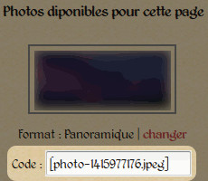

Gestion des pages d’accueil
===========================

Ajouter/supprimer une page d'accueil
------------------------------------

Il vous est possible d'ajouter une nouvelle page d'accueil de plusieurs
manières. Vous le pouvez directement depuis la page d'accueil actuelle, comme
vous l'avez sans doute remarqué en lisant l'introduction (la capture d'écran est
remise :ref:`ci-dessous <home-edit-links>`). Le lien du milieu permet cela. Le second à
droite permet l'édition de la page courante (mais nous y reviendrons un peu plus
loin), et un troisième lien à gauche permet d'accéder à la liste de toutes les pages
d'accueil.

.. _home-edit-links:

   *Les liens présents sur la page d'accueil.*

Oui, vous avez bien lu, il est possible d'avoir plusieurs pages d'accueil. Le
but n'étant pas d'en faire apparaître une aléatoirement à chaque fois qu'un
visiteur arrive sur le site, mais que vous puissiez la changer à votre guise,
conserver d'anciennes pages d'accueil pour en garder une trace, ou encore
travailler sur une nouvelle directement dans l'application tout en laissant
l'ancienne active.

Si vous cliquez sur ce troisième lien, vous arriverez sur la page visible sur
la capture d'écran :ref:`ci-dessous <homepage-list>`. Vous retrouvez en **1** un
lien pour créer une nouvelle page d'accueil. Dessous, en **2**, un menu déroulant
vous permet de choisir laquelle de ces pages doit être effectivement utilisée
comme page d'accueil. Enfin, vous disposez en **3** d'une liste des pages
d'accueil disponibles (une seule dans la capture d'écran), ainsi que de deux
liens, l'un pour éditer la page, l'un pour la supprimer.

.. _homepage-list:

   *La page permettant de gérer les pages d'accueil.*

Comme pour la suppression de photo, un message de confirmation vous sera renvoyé
pour éviter toute suppression accidentelle. Notez qu'il n'y a pour l'instant pas
de possibilité de rétablir un élément effacé. Toute photo ou page supprimée l'est
définitivement. Soyez donc sûr de votre choix !

Éditer une page d'accueil
-------------------------

Là aussi, nous venons de voir qu'il était possible d'atteindre l'éditeur de
plusieurs manières : soit directement depuis les liens présents en haut de la
page d'accueil active, soit depuis la liste de toutes les pages d'accueil
enregistrées (permettant donc d'éditer n'importe laquelle de ces pages, y compris
la page active).

Vous arrivez alors sur la page :ref:`ci-dessous <homepage-edit>`. Et découvrez
au passage une troisième manière de créer une page d'accueil au point **1**.

.. _homepage-edit:

   *L'éditeur pour page d'accueil.*

Vous devez évidemment donner un nom à votre page (point **2**) pour la retrouver
facilement dans la liste des pages existantes. L'édition de la page elle-même
est assurée (point **3**) par un traitement de texte, permettant de mettre en
forme votre contenu selon vos désirs : gras, italique, taille du texte, titres…
Je ne rentrerai pas ici dans les détails de son fonctionnement, très intuitif,
le plus simple est encore de l'essayer.

Notez cependant qu'il n'est pas possible de changer l'alignement du texte,
celui-ci est par défaut justifié (les lignes sont alignées sur les 2 bordures,
comme le contenu de cette documentation).

Insérer des photos
------------------

L'insertion des photos dans les pages d'accueil mérite une explication détaillée.
En effet, celle-ci n'est pas gérée directement par l'éditeur, mais depuis le
panneau latéral. Sur les autres pages, les photos présentées dans le panneau
sont seulement accompagnées d'un numéro les identifiant.

Pour la page d'accueil en revanche, vous trouverez le format de la photo, un
lien pour changer ce format (pour plus de détail, je vous laisse relire la partie
« :ref:`Téléversement de photos pour la page d’accueil <upload-photo-homepage>` »
et un code (capture d'écran :ref:`ci-dessous <photo-panel-home>`), unique pour
chaque photo. C'est ce code (crochets inclus) que vous devrez insérer dans le
texte. En effet, pour afficher une photo sur la page d'accueil, l'application
n'a besoin que de son format (que vous choisissez en éditant les informations
de la photo), son nom (fourni par le code) et son emplacement dans le texte
(c'est à dire là où vous placez le code).

.. _photo-panel-home:

   *Le code pour l'insertion de la photo.*

Les photos sont systématiquement centrées. Vous pouvez placer les photos seules
où à plusieurs sur une même ligne (dans ce cas, pensez bien à adapter le format
des photos au nombre que vous souhaitez placer sur une même ligne, les unes
au-dessus des autres… Le schéma :ref:`ci-dessous <photo-positions>` vous montre
quelques exemples de positionnements.

.. _photo-positions:

   *Quelques exemples d'insertion de code et leur résultat respectif.*
