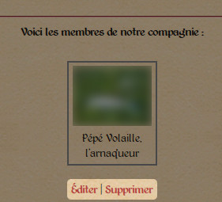
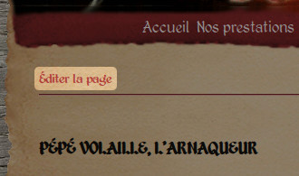
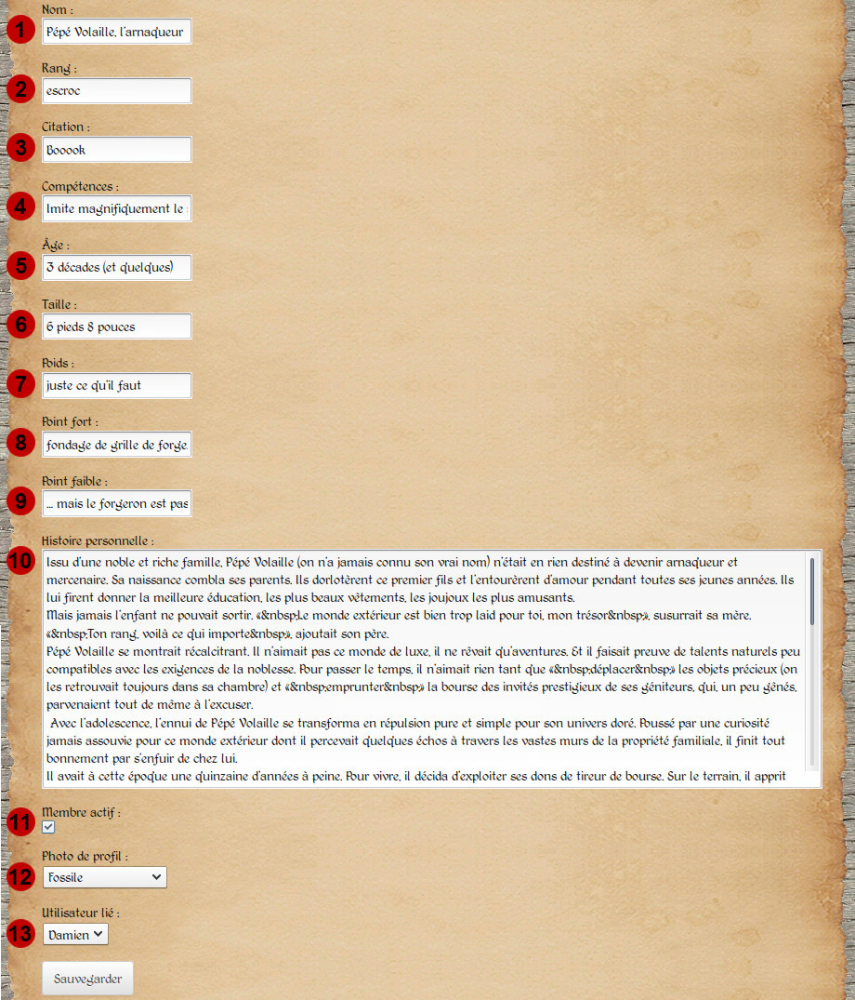

Gestion des pages de membre
===========================

Ajouter/supprimer une page de membre
------------------------------------

L'entrée « Les membres » disponible dans le menu du site vous conduit sur une
page récapitulative présentant tous les pages des membres, actifs ou non, de la
compagnie. En haut à droite de la page, un lien est disponible pour ajouter un
nouveau membre (capture d'écran :ref:`ci-dessous <member-create>`).

.. _member-create:

   *Le lien permettant d'ajouter une nouvelle page de membre.*

De plus, chaque page de membre dispose de liens permettant d'éditer et de
supprimer la page (capture d'écran :ref:`ci-dessous <member-links>`). Toute
suppression de page renverra un message de confirmation avant que la suppression
ne soit effective, afin d'éviter une suppression non désirée.

.. _member-links:

   *Édition ou suppression d'une page de membre.*

Un autre lien permettant d'éditer la page de membre est également disponible
directement sur la page elle-même (capture d'écran
:ref:`ci-dessous <member-edit-link>`). Les formulaires permettant la création ou
l'édition des pages de membres étant quasiment identiques, ils seront traités
conjointement dans la section suivante.

.. note::

    Ce lien présent sur la page de membre est évidemment le seul lien d'édition
    que verront les utilisateurs réguliers, et cela uniquement sur leur propre
    page.

.. _member-edit-link:

   *Le lien permettant d'ajouter une nouvelle page de membre.*

.. _edition-membre:

Éditer une page de membre
-------------------------

À une différence près (que nous évoquerons plus bas), lorsque vous créez une
nouvelle page de membre ou que vous éditez une page existante, vous arrivez sur
le :ref:`formulaire suivant <member-edit-page>` :

.. _member-edit-page:

   *Le formulaire permettant d'éditer une page de membre.*

Il s'agit simplement d'une suite de champs à remplir de manière adéquate :

1. le nom de scène du membre ;
2. son rang/rôle dans la compagnie ;
3. sa citation favorite ;
4. ses diverses compétences ;
5. son âge (vrai ou faux, ou réponse détournée) ;
6. sa taille (de même) ;
7. son poids (encore de même) ;
8. son point fort ;
9. son point faible ;
10. son histoire personnelle (imaginaire, bien sûr) ;
11. si le membre est encore actif dans la compagnie, ou si il s'agit d'un ancien ;
12. sa photo de profil (la liste de choix est à comparer avec les photos
    disponibles dans le panneau latéral) ;
13. le compte utilisateur lié à la page (pour permettre au dit utilisateur
    d'éditer lui même sa page).

.. note::

    Le point 12 n'est disponible que lors de l'édition de la page, pas lors de
    sa création. En effet, les photos téléversées sont liées à une page
    particulière. Tant que la page n'existe pas, il n'est donc pas possible de
    lui lier une photo. Le téléversement de photo ne peut donc être fait
    qu'après la création de la page.

Vous remarquerez qu'à part la photo de profil, vous n'avez pas à vous soucier
des autres photos. En effet, l'application se chargera pour vous de les répartir
dans le texte, tantôt à droite, tantôt à gauche. Les photos affichées dans le
texte sont sélectionnées au hasard à chaque rechargement de la page, parmi
toutes les photos disponibles pour cette page.

Vous pouvez donc téléverser autant de photos que vous le désirez pour une page
donnée. L'ensemble des photos sera visible sous forme d'album, en cliquant sur
l'icône en forme d'appareil photo présent sur la page.

.. important::

    Veillez cependant à ne pas dépasser une vingtaine de photos pour chaque page,
    car le chargement des albums et donc des pages risquerait de devenir trop long.
