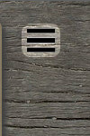
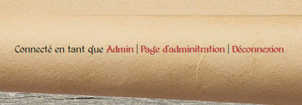

Introduction
============

Pour commencer
--------------

La première chose à faire pour pouvoir éditer une page est de s'authentifier.
Le mécanisme d'authentification est le même que pour l'application Documents,
permettant d'utiliser le même compte utilisateur.

Pour vous connecter, vous pouvez soit ouvrir l'application
`Documents <http://www.compagniefranchedukhatovar.fr/documents>`_, soit aller
directement à `cette adresse <http://www.compagniefranchedukhatovar.fr/login>`_.
Aucun lien n'est directement affiché sur le site afin de limiter le référencement
de la page de connexion, et les tentatives de création de comptes par des robots.

Seuls les utilisateurs ayant au moins le rôle d'*éditeur* dans l'application
peuvent éditer le site dans son intégralité (voir la documentation de
l'application Documents, section sécurité et rôles), et seront donc concernés
par les autres sections.

Les utilisateurs standards (comprendre sans droits d'édition ou d'administration)
sont limités à l'édition de leur page personnelle
et au téléversement de photos pour cette page uniquement. Pour des informations
détaillées, ils peuvent se rendre directement à la page dédiée aux
:doc:`utilisateurs standards <regular-users>` après la lecture de cette introduction.

Une fois connecté
-----------------

Vous remarquerez trois changements. D'abord, différents liens
sous le menu sont apparus (:ref:`voir la capture d'écran ci-dessous <edit-links>`),
vous permettant d'éditer les pages existantes, d'en créer de nouvelles… Pour
plus d'informations sur l'édition des pages, rendez-vous dans la section
:doc:`Édition des pages <edition>`.

.. _edit-links:
.. figure:: images/edit-links.jpg
   :align: center

   *Les liens disponibles sur la page d'accueil*

Vous noterez également l'apparition d'un bouton en haut à gauche, permettant
l'ouverture d'un panneau latéral (:ref:`voir la capture d'écran ci-dessous <photo-button>`).
Ce panneau permet la gestion des photos du site. Plus d'informations sont à ce
sujet disponibles dans la section :doc:`Téléversement et gestion des photos <upload>`.

.. _photo-button:

   *Le bouton permettant d'accéder au panneau latéral*

Enfin, tout en bas de la page, sur le repli du rouleau de parchemin est
habituellement affiché le Copyright de la compagnie. À la place, vous pouvez
maintenant voir quelques liens (:ref:`capture d'écran ci-dessous <admin-links>`).
Le lien à gauche vous renvoie sur la page de votre compte utilisateur (la même
page est accessible, de la même manière, depuis l'application Documents). Le
lien à droite vous permet de vous déconnecter. Le lien du milieu permet
d'accéder à la page de gestion des utilisateurs. Cependant, seuls les
administrateurs du site verront ce lien-là, car ils sont les seuls à pouvoir
accéder à cette page. Les éditeurs et les utilisateurs normaux ne verront que
les deux liens à droite et à gauche.

.. _admin-links:

   *Les liens visibles en bas de page.*

Le menu
-------

Le site dispose d'un menu déroulant renvoyant à ses différentes sections :
accueil, pages de membres, ateliers…

Ce menu n'a aucun besoin d'être édité. Il se met à jour automatiquement selon le
contenu du site. Par exemple, si un nouvel atelier est ajouté, une entrée sera
automatiquement créée sous l'entrée « Nos prestations ». De même, lors de l'ajout
d'une nouvelle page de membre, un nouveau portrait est automatiquement ajouté
à la page listant tous les membres de la compagnie. Le même fonctionnement
s'applique lors d'une suppression ou d'un renommage.
