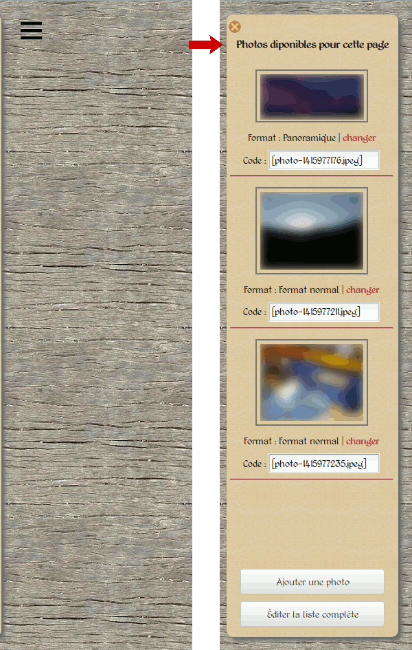
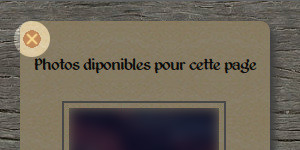
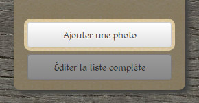
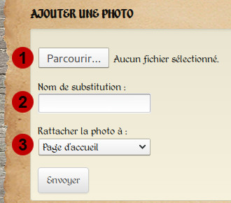
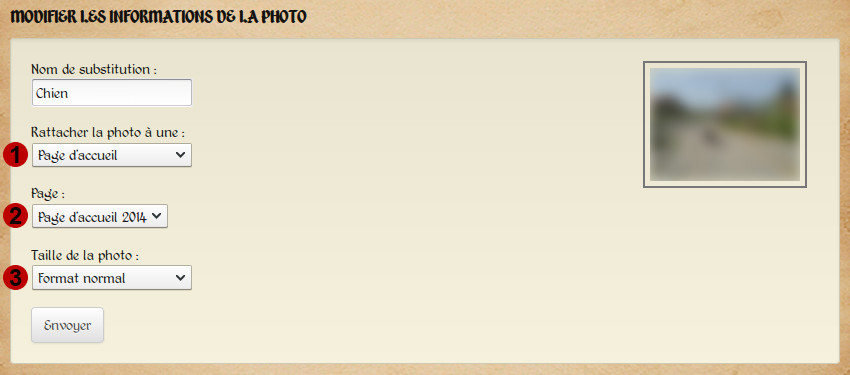
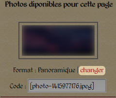
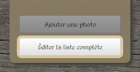
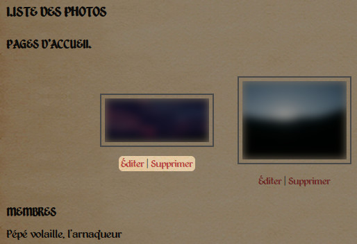

Téléversement et gestion des photos
===================================

Cette page détaille le fonctionnement du gestionnaire de photos du site. Les
informations sont en priorité écrites pour les éditeurs et administrateurs, mais
sont pour l'essentiel également valables pour les utilisateurs ordinaires. Les
sections inutiles et les différences sont indiquées tout au long des explications.

Présentation
------------

La gestion des photos est centralisée dans un panneau latéral. Ce dernier
n'est disponible que lorsque vous êtes connecté à votre compte et apparaît après
avoir cliqué sur le bouton prévu à cet effet, en haut à gauche de chaque page
du site web (:ref:`capture d'écran ci-dessous <photo-panel>`).

.. _photo-panel:

   *Le panneau latéral de gestion des photos. À gauche caché, à droite dévoilé.*

Seules les photos de la page courante apparaissent dans ce panneau latéral.
Il est possible d'obtenir une liste ordonnée de toutes les photos du site sur
la page dédiée (allez à la section « :ref:`Gestion des photos <gestion-photos>` »
pour plus d'informations.

.. note::

   En ce qui concerne les utilisateurs standards, ils n'ont évidemment accès qu'à
   leurs photos, et ceci uniquement lorsqu'il visualisent leur page de membre.
   Le reste du temps, le panneau latéral sera vide.

Il est possible de cacher le panneau à nouveau en cliquant sur le bouton prévu
à cet effet (:ref:`capture d'écran ci-dessous <photo-panel-close>`).

.. _photo-panel-close:

   *Le bouton de fermeture du panneau latéral.*

Notez que le panneau latéral disparaît automatiquement lors de chaque
changement de page (une future mise à jour du module de gestion des photos
permettra au panneau de rester sorti tant que l'utilisateur le désire).

Le téléversement des photos
---------------------------

Aperçu
^^^^^^

Pour téléverser une photo, commencez par cliquer sur le bouton prévu à cet effet,
en bas du panneau latéral (:ref:`capture d'écran ci-dessous <photo-button-add>`).

.. _photo-button-add:

   *Le bouton de téléversement.*

Vous arriverez alors sur une page affichant :ref:`le contenu suivant <page-photo-upload>` :

.. _page-photo-upload:

   *La page permettant le téléversement de fichiers.*

Les étapes
^^^^^^^^^^

Commencez par sélectionner le fichier que vous désirez téléverser en cliquant
sur le bouton « Parcourir » (:ref:`en 1 <page-photo-upload>` sur la capture
d'écran précédente).

Choisissez ensuite un nom de substitution (:ref:`menu déroulant en 2 <page-photo-upload>`).
Ce nom, pouvant être en plusieurs mots (mais limité à 50 caractères de long),
doit décrire ce que représente la photo, car il apparaîtra à la place de la
photo si celle-ci devient indisponible (effacée par erreur, renommée/déplacée,
bug…).

Enfin, sélectionnez le type de page auquel vous voulez rattacher la photo
(:ref:`menu déroulant en 3 <page-photo-upload>`) : page d'accueil, page de membre…
Cliquez sur le bouton « Envoyer », et la photo sera téléversée.

.. note::

   Ce dernier menu déroulant n'apparaîtra pas pour les utilisateurs standards.
   En effet, ces derniers ne peuvent téléverser de photo que pour leurs propres
   pages. De fait, toute la section suivante, intitulée « Des différences selon
   les pages » leur est inutile. Ils peuvent directement se rendre à la section
   :ref:`Gestion des photos <gestion-photos>`.

.. important::

    Lors d'un téléversement, l'application redimensionne automatiquement la
    photo pour qu'elle fasse 720 pixels de hauteur. Il n'y a donc aucun besoin
    de redimensionner la photo vous même. Essayez cependant de toujours
    téléverser des photos faisant au minimum 720 pixels de hauteur, afin de
    garder  une certaine « harmonie » lors du visionnage des albums photo.

.. important::

    Le téléversement est plus ou moins long selon la taille de la photo. Il peut
    donc arriver que cela prenne plusieurs secondes, soyez patients.

.. _differences:

Des différences selon les pages
-------------------------------

Une fois la photo téléversée, vous êtes redirigé sur la page d'édition de cette
photo. En effet, selon le type de page choisi, vous vous retrouvez face à des
choix différents.

.. _upload-photo-homepage:

Téléversement de photos pour la page d'accueil
^^^^^^^^^^^^^^^^^^^^^^^^^^^^^^^^^^^^^^^^^^^^^^

Votre premier choix consiste déterminer à quelle page d'accueil vous souhaitez
lier la photo (voir la capture d'écran :ref:`ci-dessous <page-photo-edit>`,
point 2).

.. _page-photo-edit:

   *Attribution d'une taille pour une photo liée aux pages d'accueil.*

Vous devez à ensuite choisir quel format vous souhaitez attribuer à votre photo :
petit, normal ou panoramique (:ref:`point 3 <page-photo-edit>`).
Le format « normal » est sélectionné par
défaut. Il est idéal lorsque vous placez une seule ou deux photos sur une même
ligne. Le « petit format » est, comme son nom l'indique, plus petit, et permet
de placer 3 ou 4 photos côte à côte sur la page. Finalement, le format
panoramique est destiné aux panoramas très larges, assemblages de plusieurs
photos. Les photos dans ce format occuperont toute la largeur de la page.

Il est possible de changer cette taille directement depuis le panneau latéral
(uniquement si vous visualisez/éditez une page d'accueil, sans quoi le panneau
affichera les photos de la page sur laquelle vous vous trouvez). Vous trouverez
en effet sous chaque photo, outre le code destiné à l'insertion des photos
(voir la section :doc:`Édition des pages d'accueil <edit-home>` pour plus de
détails), le format de l'image, et un lien renvoyant directement sur la page
permettant d'éditer les informations de la photo (:ref:`capture d'écran ci-dessous <photo-home-edit>`).

.. _photo-home-edit:

   *Changer rapidement le format d'une photo de page d'accueil.*

Veuillez noter également que si vous avez attribué à une photo un mauvais type
de page, vous pouvez le changer immédiatement (:ref:`point 1 <page-photo-edit>`. Le bouton « Envoyer »
réactualisera alors la page d'édition de la photo, vous présentant de nouveaux
choix en fonction du nouveau type de page sélectionné.

Téléversement de photos pour les autres pages
^^^^^^^^^^^^^^^^^^^^^^^^^^^^^^^^^^^^^^^^^^^^^

Dans le cas des autres types de pages, vous n'aurez pas à choisir de taille pour
la photo, car celle-ci est définie par la page elle-même. Il n'y a donc aucun
intérêt à proposer un choix de taille. Le reste est similaire à ce que vous
avez pu voir avec les pages d'accueil (nom de substitution, type de page et
pages correspondantes).

.. _gestion-photos:

Gestion des photos
------------------

Outre le téléversement des photos, vous avez également la possibilité de gérer
l'ensemble des photos du site. En cliquant sur le bouton situé tout en bas du
panneau latéral (:ref:`capture d'écran ci-dessous <photo-button-edit>`), vous
obtiendrez une liste de toutes les photos, classées par page d'appartenance.

.. note::

   Pour les utilisateurs standards, seules leurs photos seront bien évidemment
   visibles.

.. _photo-button-edit:

   *Accéder et gérer l'intégralité des photos du site*

Sous chaque photo, vous trouverez deux liens pour respectivement éditer et
supprimer la photo (:ref:`capture d'écran ci-dessous <photo-edit-links>`). Lors
de la suppression, un message de confirmation vous demandera de confirmer votre
choix pour éviter toute suppression non désirée.

.. _photo-edit-links:

   *Un aperçu de la page de gestion des photos*

Pour l'édition des photos, veuillez vous référer à la section «
:ref:`Des différences selon les pages <differences>` ».

Un dernier point : supprimer la page à laquelle est liée la photo (accueil,
membre…) ne supprimera pas la photo, mais la fera apparaître comme orpheline
dans la liste. Il est ensuite possible de la supprimer ou de la rattacher à une
nouvelle page.
